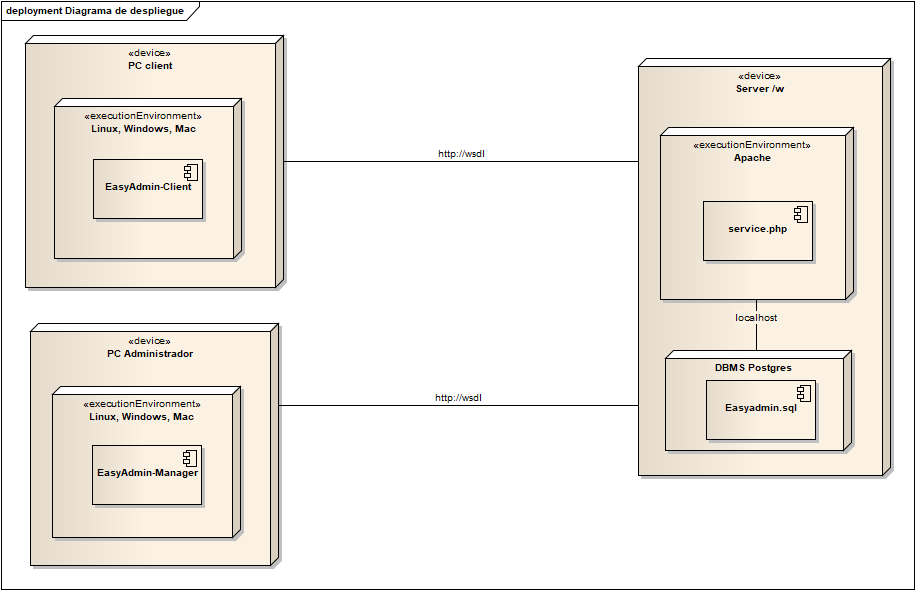
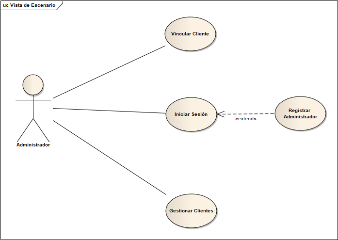

# EasyAdmin (2015)

Easy AdminPro es un software basado en tecnología cliente-servidor que asegura un excelente control para entornos de red. 

Hablamos de Easy Admin Manager & Easy Admin Client, dos programas que harán de la gestión de su ciber una tarea fácil, dándole un mejor uso a los recursos que se encuentran disponibles para los usuarios.    

## Modelo de despliegue

    

## Funcionalidades

    

**Vincular Cliente:** Se instalará en el pc cliente el producto EasyAdmin Client, el cual el
administrador podrá asociar usando su usuario y contraseña, Este equipo cliente quedará
asociado a este administrador.

**Iniciar Sesión:** Por medio del producto Easy Admin Manager el administrador entrará por
medio de su usuario y contraseña, y verá las listas de clientes vinculados a él. Opcionalmente si el usuario no tiene cuenta, podrá registrarse por medio del producto    

**Gestionar Clientes:** Esta sección incluye funciones tales como: Desbloquear, bloquear,
Apagar, Reiniciar y Cerrar Sesión del pc cliente.